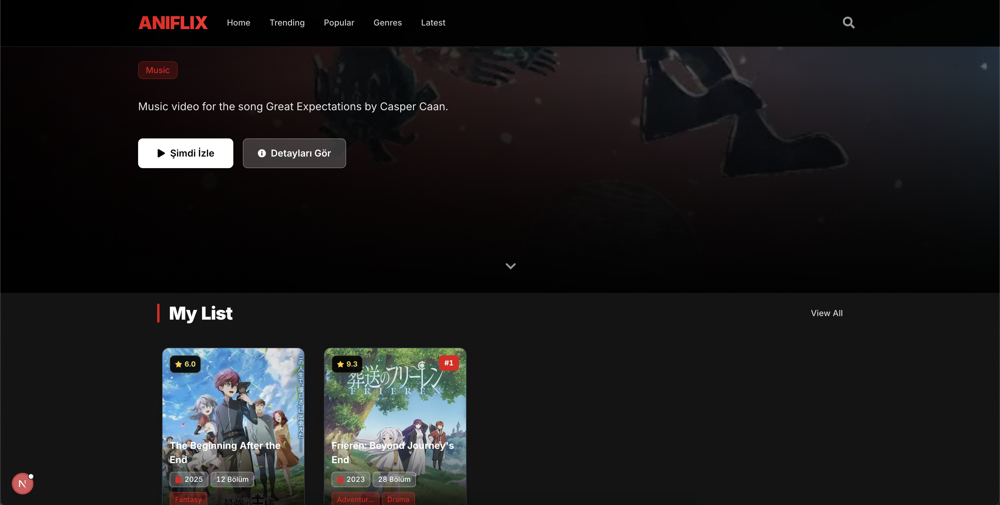

# 🎌 Aniflix

A modern, responsive anime streaming platform built with Next.js 15, React 18, and TypeScript. Discover, watch, and track your favorite anime series with a beautiful Netflix-inspired interface.



## ✨ Features

### 🎬 **Anime Discovery**
- **Hero Section** with featured anime showcase
- **Top 10 Anime Today** with real-time rankings
- **Seasonal Anime** recommendations
- **Genre-based Collections** (Action, Romance, etc.)
- **Trending Now** section

### 📱 **User Experience**
- **Continue Watching** - Resume your anime journey
- **My List** - Personal favorites collection
- **Responsive Design** - Perfect on all devices
- **Smooth Animations** - Powered by Framer Motion
- **Dark Theme** - Easy on the eyes

### 🔍 **Interactive Features**
- **Search Functionality** with real-time results
- **Detailed Anime Modals** with comprehensive information
- **Episode Tracking** with progress indicators
- **Toast Notifications** for user feedback
- **Keyboard Navigation** support

### 💾 **Data Management**
- **Local Storage** for user preferences
- **Continue Watching** state persistence
- **My List** favorites management
- **Recently Viewed** history

## 🛠️ Tech Stack

- **Framework**: Next.js 15 (App Router)
- **Language**: TypeScript
- **Styling**: Tailwind CSS
- **Animations**: Framer Motion
- **Icons**: React Icons
- **Data Source**: Jikan API (MyAnimeList)
- **Package Manager**: Bun

## 🚀 Getting Started

### Prerequisites

- Node.js 18+ or Bun
- Git

### Installation

1. **Clone the repository**
   ```bash
   git clone https://github.com/sw3do/aniflix.git
   cd aniflix
   ```

2. **Install dependencies**
   ```bash
   bun install
   ```

3. **Start the development server**
   ```bash
   bun run dev
   ```

4. **Open your browser**
   Navigate to [http://localhost:3000](http://localhost:3000)

## 📁 Project Structure

```
aniflix/
├── src/
│   ├── app/                    # Next.js App Router
│   │   ├── page.tsx           # Home page
│   │   ├── layout.tsx         # Root layout
│   │   └── globals.css        # Global styles
│   ├── components/            # React components
│   │   ├── AnimeCard.tsx     # Anime display card
│   │   ├── AnimeCarousel.tsx # Horizontal anime carousel
│   │   ├── AnimeModal.tsx    # Detailed anime modal
│   │   ├── Header.tsx        # Navigation header
│   │   ├── HeroSection.tsx   # Featured anime hero
│   │   └── ...               # Other components
│   └── lib/                   # Utilities and API
│       ├── api.ts            # Jikan API integration
│       └── localStorage.ts    # Local storage utilities
├── public/                    # Static assets
├── tailwind.config.js        # Tailwind configuration
└── package.json              # Dependencies and scripts
```

## 🎨 Components Overview

### Core Components

- **`AnimeCard`**: Interactive anime cards with hover effects
- **`AnimeCarousel`**: Horizontal scrolling anime collections
- **`AnimeModal`**: Detailed anime information modal
- **`Header`**: Navigation with search functionality
- **`HeroSection`**: Featured anime showcase
- **`ContinueWatchingCard`**: Resume watching interface
- **`Top10Card`**: Special ranking display cards

### Utility Components

- **`LoadingSkeleton`**: Elegant loading states
- **`Toast`**: User notification system

## 🌐 API Integration

Aniflix uses the [Jikan API](https://jikan.moe/) to fetch anime data from MyAnimeList:

- **Top Anime**: Highest rated series
- **Seasonal Anime**: Current season releases
- **Genre Filtering**: Action, Romance, etc.
- **Search**: Real-time anime search
- **Details**: Comprehensive anime information

## 📱 Responsive Design

- **Mobile First**: Optimized for mobile devices
- **Tablet Friendly**: Smooth tablet experience
- **Desktop Enhanced**: Full desktop functionality
- **Touch Gestures**: Mobile-friendly interactions

## 🎯 Key Features Breakdown

### Continue Watching
- Track viewing progress
- Resume from last watched episode
- Progress percentage display
- Easy removal from list

### My List
- Personal favorites collection
- Add/remove functionality
- Persistent storage
- Quick access interface

### Search & Discovery
- Real-time search suggestions
- Genre-based filtering
- Trending recommendations
- Seasonal anime updates

## 🚀 Performance Optimizations

- **Image Optimization**: Next.js Image component
- **Lazy Loading**: Components load on demand
- **Skeleton Loading**: Smooth loading states
- **Efficient Animations**: Optimized Framer Motion
- **Local Storage**: Client-side state persistence

## 🔧 Development Commands

```bash
# Development server
bun run dev

# Production build
bun run build

# Start production server
bun run start

# Lint code
bun run lint
```

## 🤝 Contributing

We welcome contributions! Please follow these steps:

1. Fork the repository
2. Create a feature branch (`git checkout -b feature/amazing-feature`)
3. Commit your changes (`git commit -m 'Add amazing feature'`)
4. Push to the branch (`git push origin feature/amazing-feature`)
5. Open a Pull Request

## 📄 License

This project is licensed under the MIT License - see the [LICENSE](LICENSE) file for details.

## 🙏 Acknowledgments

- **[Jikan API](https://jikan.moe/)** for providing anime data
- **[MyAnimeList](https://myanimelist.net/)** for the comprehensive anime database
- **[Next.js](https://nextjs.org/)** for the amazing React framework
- **[Tailwind CSS](https://tailwindcss.com/)** for the utility-first styling
- **[Framer Motion](https://www.framer.com/motion/)** for smooth animations

## 📞 Support

If you have any questions or need help, please:

- Open an issue on GitHub
- Check the documentation
- Review existing issues and discussions

---

**Built with ❤️ by [sw3do](https://github.com/sw3do)**

